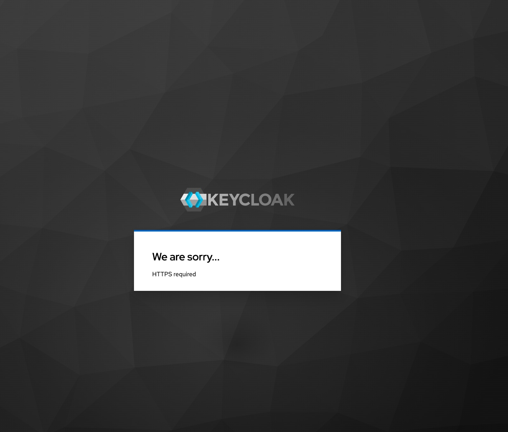

# Vocabulary API
Vocabulary Builder: Embrace the essence of traditional paper vocabularies in a digital format.    

Effortlessly organize, learn, and reinforce new words with the added power of interactive flashcards.

[](https://github.com/egch/vocabulary/actions/workflows/maven.yml)

## Prerequisites
- Java 21+
- A Docker environment supported by Testcontainers: <https://www.testcontainers.org/supported_docker_environment/> (a recent local Docker installation is enough)

## Getting Started
Clone the repository and run the following command to build the project:

```shell
$ mvn clean verify
```

## starting the application locally
Replace client-id and client-secret with your own.
### from cli with maven

```shell
$ mvn spring-boot:run 
```

### with intellij

### Accessing Swagger
[Swagger-localhost](http://localhost:9090/swagger-ui/index.html#/)

### Spring Actuator - env
[actuator](http://localhost:9090/actuator/env/)

## Get the access token
### as an user

```shell
TOKEN=$(curl -X POST \
  http://localhost:18081/realms/vocabulary/protocol/openid-connect/token \
  -H 'Content-Type: application/x-www-form-urlencoded' \
  -d username=enrico \
  -d password=enrico \
  -d grant_type=password \
  -d client_id=vocabulary-rest-api \
  | jq -r .access_token)
  

```
### as an admin
```shell
TOKEN=$(curl -X POST \
  http://localhost:18081/realms/vocabulary/protocol/openid-connect/token \
  -H 'Content-Type: application/x-www-form-urlencoded' \
  -d username=admin \
  -d password=admin \
  -d grant_type=password \
  -d client_id=vocabulary-rest-api \
  | jq -r .access_token)
```

### copy the token to the clipboard
```shell
echo $TOKEN | pbcopy    
```
### copy to swagger


## Keycloak
### Keycloak admin console
[keycloak console](http://localhost:18081/admin/master/console/)

Switch to `vocabulary` realm.
## Export the realm
```shell
docker exec -it vocabulary-api-keycloak-1 bash
##within the docker container 
mkdir opt/keycloak/data/import/
  
/opt/keycloak/bin/kc.sh export --file /opt/keycloak/data/import/vocabulary-realm.json --users same_file --realm  vocabulary --verbose \
  --db=postgres \
  --db-url=jdbc:postgresql://postgres_keycloak:5432/keycloak-vocabulary-db \
  --db-username=keycloak \
  --db-password=keycloak
exit
  
##out of the docker container 
docker cp vocabulary-api-keycloak-1:/opt/keycloak/data/import/vocabulary-realm.json /Users/enrico/github/vocabulary-org/vocabulary-api/keycloak/vocabulary-realm.json

```

## Troubleshooting 
### Keycloak logs
```shell
docker logs -f vocabulary-api-keycloak-1
```
### SSL issues



```shell
enrico@Mac-mini-3 ~ % docker exec -it vocabulary-api-keycloak-1 bash
bash-5.1$ cd /opt/keycloak/bin/
bash-5.1$ ./kcadm.sh config credentials \
  --server http://127.0.0.1:8080 \
  --realm master \
  --user admin \
  --password Pa55w0rd
Logging into http://127.0.0.1:8080 as user admin of realm master

bash-5.1$ ./kcadm.sh update realms/vocabulary -s sslRequired=NONE

```

## Docker
### Build the image
Build and upload a docker image on github.

```shell
mvn spring-boot:build-image
docker login
docker tag vocabulary/vocabulary-api egch/vocabulary-api:latest
docker push egch/vocabulary-api:latest
```

### Running the service with Docker Compose
A `docker-compose-vocabulary-api.yaml` file is provided to run the service with Docker Compose:

```shell
docker compose -f docker-compose-vocabulary-api.yaml up
```
### network
For simplicity, assign a domain name to the KeyCloak server, for example `keycloak.local`, and add the following line to your `/etc/hosts` file:

```text
127.0.0.1 localhost keycloak.local
```

The Keycloak server is available at <http://keycloak.local:18080>. You can access the administration console with the `admin` user and the `Pa55w0rd` password.


## References
- [testcontainers-keycloak](https://github.com/dasniko/testcontainers-keycloak)
- [Setting up Gmail SMTP for Keycloak](https://www.youtube.com/watch?v=wwOKKwMq5pA)


## Credits
Developed with the [YourRents Geodata](https://github.com/your-rents) technology stack.
