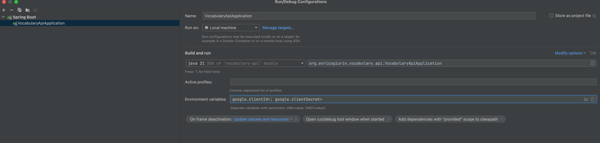

# Vocabulary API
Vocabulary Builder: Embrace the essence of traditional paper vocabularies in a digital format.    

Effortlessly organize, learn, and reinforce new words with the added power of interactive flashcards.

[](https://github.com/egch/vocabulary/actions/workflows/maven.yml)

## Prerequisites
- Java 21+
- A Docker environment supported by Testcontainers: <https://www.testcontainers.org/supported_docker_environment/> (a recent local Docker installation is enough)

## Getting Started
Clone the repository and run the following command to build the project:

```shell
$ mvn clean verify
```

## starting the application locally
Replace client-id and client-secret with your own.
### from cli with maven

```shell
$ mvn spring-boot:run 
```

### with intellij

### Accessing Swagger
[Swagger-localhost](http://localhost:9090/swagger-ui/index.html#/)


### Get the access token

```shell
TOKEN=$(curl -X POST \
  http://keycloak.local:18081/realms/vocabulary/protocol/openid-connect/token \
  -H 'Content-Type: application/x-www-form-urlencoded' \
  -d username=enrico \
  -d password=enrico \
  -d grant_type=password \
  -d client_id=vocabulary-rest-api \
  | jq -r .access_token)
```


## Credits
Developed with the [YourRents Geodata](https://github.com/your-rents) technology stack.
