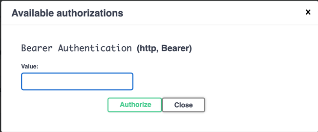

# Vocabulary API
Vocabulary Builder: Embrace the essence of traditional paper vocabularies in a digital format.    

Effortlessly organize, learn, and reinforce new words with the added power of interactive flashcards.

[](https://github.com/egch/vocabulary/actions/workflows/maven.yml)

## Prerequisites
- Java 21+
- A Docker environment supported by Testcontainers: <https://www.testcontainers.org/supported_docker_environment/> (a recent local Docker installation is enough)

## Getting Started
Clone the repository and run the following command to build the project:

```shell
$ mvn clean verify
```

## starting the application locally

### from cli with maven
```shell
$ mvn spring-boot:run 
```

## Swagger
### Accessing Swagger
[Swagger-localhost](http://localhost:9090/swagger-ui/index.html#/)

### Get the access token
#### as an user

```shell
TOKEN=$(curl -X POST \
  http://localhost:18081/realms/vocabulary/protocol/openid-connect/token \
  -H 'Content-Type: application/x-www-form-urlencoded' \
  -d username=enrico \
  -d password=enrico \
  -d grant_type=password \
  -d client_id=vocabulary-rest-api \
  | jq -r .access_token)
  

```
#### as an admin
```shell
TOKEN=$(curl -X POST \
  http://localhost:18081/realms/vocabulary/protocol/openid-connect/token \
  -H 'Content-Type: application/x-www-form-urlencoded' \
  -d username=admin \
  -d password=admin \
  -d grant_type=password \
  -d client_id=vocabulary-rest-api \
  | jq -r .access_token)
```

#### copy the token to the clipboard
```shell
echo $TOKEN | pbcopy    
```

### copy to swagger


## Miscellaneous
### Spring Actuator - env
[actuator](http://localhost:9090/actuator/env/)

### Keycloak admin console
[keycloak console](http://localhost:18081/admin/master/console/)

You can access the administration console with the `admin` user and the `Pa55w0rd` password.
Switch to `vocabulary` realm.

## Running the application locally behind the nginx
### network
Assign a domain name to the KeyCloak server `keycloak.local`, by adding the following line to your `/etc/hosts` file:
```text
127.0.0.1 localhost keycloak.local
```
### KC
The Keycloak server is available at <http://keycloak.local:18081>. 
You can access the administration console with the `admin` user and the `Pa55w0rd` password.


### Starting the backend
```shell
mvn spring-boot:run -Dspring-boot.run.profiles=nginx
```
### Starting the nginx (as a docker service)

```shell
docker compose -f docker-compose-nginx.yaml up
```
### Get the access token
Use the same **curl** command as shown in [Get the access token](#get-the-access-token), **but make sure to replace** `localhost` with `keycloak.local`.


## Running the service with Docker Compose
A `docker-compose-vocabulary-api.yaml` file is provided to run the service with Docker Compose:

```shell
docker compose -f docker-compose-vocabulary-api.yaml up
```


## Developer Notes
[Developer Notes](DeveloperNotes.md)


## References
- [testcontainers-keycloak](https://github.com/dasniko/testcontainers-keycloak)
- [Setting up Gmail SMTP for Keycloak](https://www.youtube.com/watch?v=wwOKKwMq5pA)
- [Configure a Docker Nginx Reverse Proxy Image and Container](https://youtu.be/ZmH1L1QeNHk?si=MOyHUDYLzyxB_NUh)


## Credits
Developed with the [YourRents Geodata](https://github.com/your-rents) technology stack.
