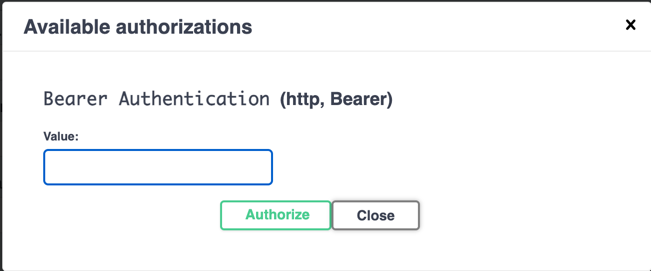

# Vocabulary API
Vocabulary Builder: Embrace the essence of traditional paper vocabularies in a digital format.    

Effortlessly organize, learn, and reinforce new words with the added power of interactive flashcards.

[](https://github.com/egch/vocabulary/actions/workflows/maven.yml)

## Prerequisites
- Java 25+
- A Docker environment supported by Testcontainers: <https://www.testcontainers.org/supported_docker_environment/> (a recent local Docker installation is enough)

## Java Version
This project requires **Java 25**. 

## Getting Started
Clone the repository and run the following command to build the project:

```shell
$ mvn clean verify
```

## Running the application locally behind the nginx
### network
Assign a domain name to the KeyCloak server `keycloak.local`, by adding the following line to your `/etc/hosts` file:
```text
127.0.0.1 localhost keycloak.local
```
### KC
The Keycloak server is available at <http://keycloak.local:18081>.
You can access the administration console with the `admin` user and the `pwd` password.

## External API Keys

The application requires the following external API keys when running locally.
Add them as JVM arguments in your IntelliJ run configuration (**Run → Edit Configurations → VM options**):

```
-DAZURE_TRANSLATOR_KEY=<your-azure-translator-key>
-DANTHROPIC_API_KEY=<your-anthropic-api-key>
```

## Starting the application locally

### with NO nginx
```shell
$ mvn spring-boot:run 
```
Alternatively, you can run the application locally in Intellij.

### nginx (http) proxy edge
```shell
mvn spring-boot:run -Dspring-boot.run.profiles=nginx
```
Alternatively, you can run the application locally in IntelliJ with `nginx` set as the active Spring profile.   
Starting the nginx:
```shell
cd docker-compose
docker compose -f docker-compose-nginx.yaml up
```

### nginx-ssl (https) proxy edge
```shell
mvn spring-boot:run -Dspring-boot.run.profiles=nginx-ssl
```
Alternatively, you can run the application locally in IntelliJ with `nginx-ssl` set as the active Spring profile.

Starting the nginx-ssl:
```shell
cd docker-compose
docker compose -f docker-compose-nginx-ssl.yaml up
```


## Swagger
### Accessing Swagger
[Swagger-localhost](http://localhost:9090/swagger-ui/index.html#/)

### Get the access token
#### as an user

```shell
TOKEN=$(curl -X POST \
  http://localhost:18081/realms/vocabulary/protocol/openid-connect/token \
  -H 'Content-Type: application/x-www-form-urlencoded' \
  -d username=enrico \
  -d password=enrico \
  -d grant_type=password \
  -d client_id=vocabulary-rest-api \
  | jq -r .access_token)
  

```
#### as an admin
```shell
TOKEN=$(curl -X POST \
  http://localhost:18081/realms/vocabulary/protocol/openid-connect/token \
  -H 'Content-Type: application/x-www-form-urlencoded' \
  -d username=admin \
  -d password=admin \
  -d grant_type=password \
  -d client_id=vocabulary-rest-api \
  | jq -r .access_token)
```

#### copy the token to the clipboard
```shell
echo $TOKEN | pbcopy    
```

### copy to swagger


## Miscellaneous
### Spring Actuator
Only `health` and `info` are exposed, and everything under `/actuator/**` beyond those requires the
`ADMIN` role. Sensitive endpoints (`env`, `heapdump`, `configprops`) are deliberately off: they leak
every secret the application holds, and on a public host they are actively scanned for.

[health](http://localhost:9090/actuator/health)

To inspect `env` while developing locally, enable it in `application-local.yml` (git-ignored) and run
with the `local` profile — never in a committed profile:

```yaml
management:
  endpoints:
    web:
      exposure:
        include: "*"
  endpoint:
    env:
      show-values: ALWAYS
```

### Keycloak admin console
[keycloak console](http://localhost:18081/admin/master/console/)

You can access the administration console with the `admin` user and the `Pa55w0rd` password.
Switch to `vocabulary` realm.


### Get the access token
Use the same **curl** command as shown in [Get the access token](#get-the-access-token), **but make sure to replace** `localhost` with `keycloak.local`.


## Running the service with Docker Compose
A `docker-compose-vocabulary-api.yaml` file is provided to run the service with Docker Compose:

```shell
docker compose -f docker-compose-vocabulary-api.yaml up
```


## Unit Tests

Run the full test suite:
```shell
mvn test
```

### Skipping slow Keycloak tests

Tests tagged with `keycloak` (e.g. `KeycloakClientServiceTest`) spin up a Testcontainers Keycloak instance and can be slow.
To skip them, activate the `skip-keycloak` Maven profile:

```shell
mvn test -P skip-keycloak
```

## Build and publish the Docker image

Use `scripts/deploy-image.sh` to build the Spring Boot image, tag it, and push it to Docker Hub:

```shell
./scripts/deploy-image.sh <version>
```

Example:

```shell
./scripts/deploy-image.sh 1.0.5
```

This will run `mvn spring-boot:build-image`, tag the result as `egch/vocabulary-api:<version>`, and push it to Docker Hub.

> See [Hetzner Notes](docs/api-hetzner.md) for the server-side deployment step.

## Developer Notes
* [Developer Notes](docs/developer-notes.md)
* [Hetzner Notes](docs/api-hetzner.md)


## Oauth login
Adding Google Oauth2.0 as identity provider.  
[Google Cloud Console](https://console.cloud.google.com/)

[Keycloak Social Logins - Integrate Google](https://www.youtube.com/watch?v=RUXY5xqpq0A&list=PLaY-ehgC8dNOnVZxgKKY5kwjezQmQChSG&index=16&t=379s)

### Configure Default Group for New Users (Keycloak)

To automatically assign a group to every newly created user:

1. Open **Keycloak Admin Console**
2. Navigate to  
   **Realm Settings → User registration**
3. In **Default Group**, click **Add a group**
4. Select the group (e.g. `/vocabulary-users`)
5. Save the configuration

✅ Every new user (Google login, username/password, etc.) will now be automatically added to this group.


## References
- [testcontainers-keycloak](https://github.com/dasniko/testcontainers-keycloak)
- [Setting up Gmail SMTP for Keycloak](https://www.youtube.com/watch?v=wwOKKwMq5pA)
- [Configure a Docker Nginx Reverse Proxy Image and Container](https://youtu.be/ZmH1L1QeNHk?si=MOyHUDYLzyxB_NUh)
- [Let's Encrypt Tutorial: Free SSL Certificate For Your Server](https://www.youtube.com/watch?v=iNFpyWFGl3M&t=554s)


## Credits
Developed with the [YourRents Geodata](https://github.com/your-rents) technology stack.
