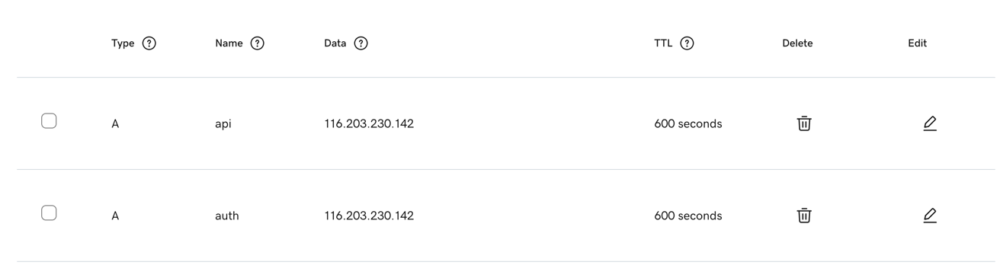
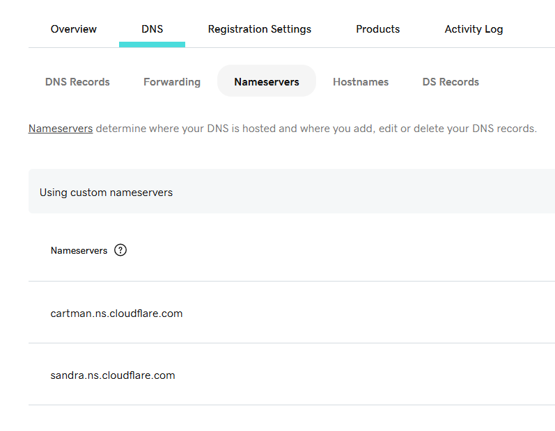
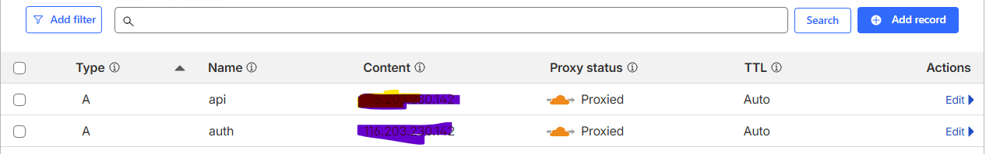

# Running on Hetzner
## Installing docker on Ubuntu

````shell
#!/bin/bash
set -e

# Update system
sudo apt-get update
sudo apt-get install -y ca-certificates curl gnupg lsb-release

# Add Docker’s official GPG key
sudo install -m 0755 -d /etc/apt/keyrings
curl -fsSL https://download.docker.com/linux/ubuntu/gpg | \
  sudo gpg --dearmor -o /etc/apt/keyrings/docker.gpg
sudo chmod a+r /etc/apt/keyrings/docker.gpg

# Add Docker repo
echo \
  "deb [arch=$(dpkg --print-architecture) signed-by=/etc/apt/keyrings/docker.gpg] \
  https://download.docker.com/linux/ubuntu $(lsb_release -cs) stable" | \
  sudo tee /etc/apt/sources.list.d/docker.list > /dev/null

# Update again with Docker repo
sudo apt-get update

# Install Docker Engine + Compose v2 plugin
sudo apt-get install -y docker-ce docker-ce-cli containerd.io docker-buildx-plugin docker-compose-plugin

# Enable Docker at startup
sudo systemctl enable docker
sudo systemctl start docker

````
### Checks
````shell
docker --version
docker compose version

````
You should see something like:
````shell
Docker version 27.0.3, build abc123
Docker Compose version v2.29.2
````
### Add your user to docker
````shell
sudo usermod -aG docker $USER
newgrp docker
````

## Running docker compose
````shell
sudo docker compose -f docker-compose-vocabulary-api.yaml up
````

## Subdomains configuration
### Define the DNS for the subdomains

From the [Godaddy](https://www.godaddy.com/en) DNS console.



### SSL Certificates via Cloudflare

See [ssl-cloudflare-certificates.md](ssl-cloudflare-certificates.md).

### ~~SSL certbot configuration (Deprecated)~~
Check if the DNS is active.
```shell
dig +short api.myvocabulary.net 
dig +short auth.myvocabulary.net 
```
Create the certificates with [certbot](https://certbot.eff.org/).

Also make sure that port 80 on the virtual server is open during certificate creation.
```shell
 sudo certbot certonly --standalone   -d auth.myvocabulary.net
 sudo certbot certonly --standalone   -d api.myvocabulary.net
```
Once the certificates are created, copy the `fullchain.pem` and `privkey.pem `
for each subdomain (auth, api) into a directory that Nginx (running in Docker) 
can access as a mounted volume.

Make the certificate files readable by all users using **chmod**. 
### Protecting API with Cloudflare
- signup with [Cloudflare](https://www.cloudflare.com/en-gb/)
- register the domain (myvocabulary.net) in CloudFlare
- Change the DNS nameserver in godaddy (provider of myvocabulary.net) with those provided by Cloudflare.





Verify the correct protection:
```shell
curl -I https://api.myvocabulary.net
```
### Hetzner Firewall
Add the following IP ranges to the Hetzner FW:
[Cloudflare IP Ranges](https://www.cloudflare.com/en-gb/ips/)

## Connecting to the remote DB in Hetzner
Ensure that Postgres is bound only to localhost inside the server by adding the following to your `docker-compose-vocabulary-api.yml`:
````yaml
    ports:
      - 127.0.0.1:5432:5432
````
Open an SSH tunnel from your PC/Mac to securely forward the database port:
````shell
 ssh -L 5433:127.0.0.1:5432 user_hetzner@<PUBLIC-IP>
````
Connecting via DBViewer:

- Host: localhost
- Port: 5433
- Database: vocabulary_api
- User: <your-postgres-user> (in docker file)
- Password: <your-postgres-password> (in docker file)

### Termius Port Forwarding Setup (Hetzner Postgres)

To avoid running the SSH command manually each time, configure a Local Port Forwarding rule in Termius.

#### 1. Local (Your Mac)
Fill in:

```
Local address: 127.0.0.1
Local port: 5433
```

This creates the local endpoint `localhost:5433` on your Mac.

---

#### 2. Intermediate (SSH Host)
When Termius asks to “Select a host”, choose your Hetzner server entry.

It should look like:

```
SSH Host: user_hetzner@<PUBLIC-IP>
Port: 22
Identity: <your-private-key>
```

This is the SSH server through which the tunnel passes.

---

#### 3. Destination (Remote Postgres inside Hetzner)
Configure where Termius should forward traffic *inside the server*:

```
Destination address: 127.0.0.1
Destination port: 5432
```

This is the Postgres instance bound to localhost on the Hetzner VM.

---

#### Result
The tunnel created is:

```
Mac localhost:5433  →  SSH Tunnel →  Hetzner 127.0.0.1:5432
```

Once saved, click **Start** and DBViewer can connect using:

```
Host: localhost
Port: 5433
Database: vocabulary_api
User: <your-postgres-user>
Password: <your-postgres-password>
```

## Deploying a new version

Use the `deploy-vocabulary-api.sh` script from the Hetzner server to pull and restart the stack with a specific image version.

```shell
cd docker-hetzner/scripts
./deploy-vocabulary-api.sh <version>
```

Example:

```shell
./deploy-vocabulary-api.sh 1.0.5
```

The script will:
1. Bring down the running compose stack
2. Remove the existing local image for that version (if any)
3. Pull `egch/vocabulary-api:<version>` from the registry
4. Restart the stack with the new image via `IMAGE_TAG=<version> docker compose up -d`

> Run the script from inside `docker-hetzner/scripts/` — the compose file path is relative.

---

## Check the Docker logs
### Keycloak log
```shell
docker logs -f docker-hetzner-keycloak-1
```

### Vocabulary log
```shell
docker logs -f docker-hetzner-vocabulary-api-1
```
## External logs (mounted)
### Configuration
```shell
mkdir -p /home/enrico/vocabulary/logs
chmod 777 /home/enrico/vocabulary/logs
```

## OTP Authentication for Keycloak Admin Console

Reference video: [Keycloak OTP / 2FA setup with MS Authenticator](https://www.youtube.com/watch?v=CjYtgHcV_3c)

### Steps

1. **Log in** to the Keycloak Admin Console
2. Go to **Authentication** → **Required Actions** → find **Configure OTP** and set it as **Default**
3. Go to **Users** → select the **admin** user → **Required User Actions** → add **Configure OTP**
4. On next login, Keycloak will prompt OTP enrollment — scan the **QR code** using **Microsoft Authenticator** (or any TOTP app): tap **+** → **Work or school account** → **Scan QR code**
5. Enter the **6-digit OTP** from the app to complete enrollment
6. On subsequent logins, enter your password then the **current OTP** from the app

> OTP codes rotate every 30 seconds. Make sure the server clock is synced (NTP).

---

## Brevo SMTP Configuration in Keycloak

[Brevo](https://app.brevo.com)

In the `vocabulary` realm → **Realm Settings** → **Email** tab, configure:

| Field          | Value                                        |
|----------------|----------------------------------------------|
| Host           | `smtp-relay.brevo.com`                       |
| Port           | `587`                                        |
| From           | `support@myvocabulary.net`                   |
| SSL            | Off                                          |
| StartTLS       | On                                           |
| Authentication | Enabled                                      |
| Username       | *(Brevo SMTP login — found in SMTP & API tab, looks like `xxxxxxx@smtp-brevo.com`)* |
| Password       | *(Brevo SMTP key — found in SMTP & API tab)* |

> The username is **not** your Brevo account email. Go to Brevo → **SMTP & API** → **SMTP** tab to find the dedicated SMTP login and key.

### Domain verification in Brevo

Before sending works, verify `myvocabulary.net` in Brevo:

1. Brevo → **Senders & IP** → **Domains** → **Add a domain** → enter `myvocabulary.net`
2. Brevo will provide DNS records (TXT for verification + DKIM CNAME)
3. Add those records in **Cloudflare** under `myvocabulary.net` DNS tab
4. Come back to Brevo and click **Verify**

Once verified, `support@myvocabulary.net` is an allowed sender.

Save and use **Test connection** to verify.

---

## Keycloak Admin Client (Service Account)

The API uses a dedicated Keycloak client (`vocabulary-api-admin`) with client credentials to manage users (registration, deletion), instead of username/password auth. This avoids issues with OTP being required on the admin user.

### Setup in Keycloak (master realm)

1. **Clients** → **Create client**
   - Client ID: `vocabulary-api-admin`
   - Enable **Client authentication** → ON
   - Enable **Service accounts roles** → ON
2. **Credentials tab** → copy the **Client secret**
3. **Service Account Roles tab** → Assign role → filter by clients → `vocabulary-realm` → assign **`manage-users`**

### Environment variable

Add to your `.env` on the Hetzner server:

```
KEYCLOAK_ADMIN_CLIENT_SECRET=<client-secret-from-step-2>
AZURE_TRANSLATOR_KEY=<your-azure-translator-key>
ANTHROPIC_API_KEY=<your-anthropic-api-key>
```

---

## 🔐 Fix: 400 Bad Request (Invalid redirect_uri)

### Problem
Keycloak returned **400 Bad Request** during login from:

https://www.myvocabulary.net

### Fix

In **Keycloak Admin Console**:

Clients → `vocabulary-rest-api` → Settings

Add to **Valid Redirect URIs**:

https://www.myvocabulary.net/*

(Optional but recommended) Add to **Web Origins**:

https://www.myvocabulary.net

Save.

This resolves the 400 error caused by an unregistered `redirect_uri`.
